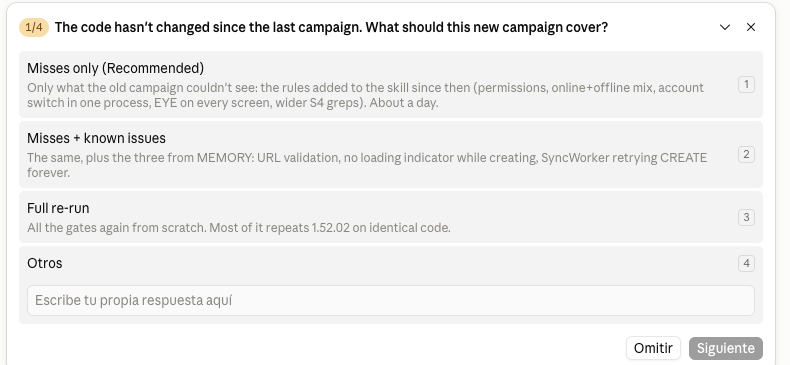

# qa-campaign

[](https://www.skills.sh/DesarrolloAntonio/qa-campaign)

A Claude Code skill for running a **pre-release QA campaign** on a product you can drive from the
command line — and, more importantly, a set of rules that stop the campaign from lying to you.

```bash
npx skills add DesarrolloAntonio/qa-campaign
```

Then, in the project you want to test: **`/qa-campaign`**. There is no prompt to write — the skill
runs the interview itself, and nothing is touched until you have answered it.

**Contents:** [What it gives you](#what-it-actually-gives-you) · [Before you run it](#before-you-run-it) ·
[Start a campaign](#start-a-campaign) · [What it asks first](#what-it-asks-before-it-touches-anything) ·
[How a campaign goes](#how-a-campaign-goes) · [Credentials](#credentials-and-why-it-never-types-your-password) ·
[The fake server](#the-fake-server) · [A real campaign](#a-campaign-as-it-came-out) ·
[Other platforms](#any-project-not-just-mobile) · [The harness](#the-harness) · [Status](#status)

It was used on one production release: a dozen gated processes, **79 defects found, 77 fixed** (the
other two were product decisions). Every fix was verified in the running app; most carry a
regression test that was watched fail before it was trusted, and the ones that don't say so.

## What it actually gives you

The scripts are the cheap half. The valuable half is in [`SKILL.md`](SKILL.md) — fourteen rules,
each of which earned its place on a real campaign:

- **Gates, not a checklist.** A flat list of N scenarios × M devices is never executed; a short list
  of gates with a hard stop at each one is.
- **Inventory before catalogue** — and then the **absence sweeps**, because deriving tests from the
  code enumerates what the app *has* and is structurally blind to what it *lacks*. That is where the
  dead "Privacy Policy" button and the settings screen that never names your server come from.
- **Never one oracle.** The screen, the client's own store, the server, and a reference
  implementation — and a rule for what to do when they disagree. The interesting defects live in the
  gap between two of them: an optimistic UI reporting success for a write the server refused is
  invisible to any single one.
- **Seen red, always.** A regression test does not exist until you have watched it fail.
- **The harness is under test too.** When your tool reports a defect, its first suspect is itself —
  a false positive costs more than a miss, because it trains you to ignore the tool. And it must
  never print a silent all-clear. The harness here has its own suite: `tests/run`, against a fake
  device, with nothing plugged in.

## Before you run it

A campaign is not a read-only audit. It **installs and drives builds on real devices**, **signs in and
writes to a server**, **changes your source** (fixes, tests, and deliberate breaks it undoes after),
and **deletes the test data it created**. It asks before leaving the ground agreed at setup — that is
R2 — but the ground is what you tell it, and an agent can still get it wrong.

So, every time:

- **on a branch of its own**, with a clean tree before it starts (it will ask; say yes to the branch);
- **a test server and test accounts**, never a personal or production account. No disposable server?
  R10 says what to do instead — and say out loud which data must not be touched;
- **the devices you name and no others**: list them in `qa.config.json` and the scripts refuse the
  rest, so nothing lands on a work or personal phone;
- **a backup of anything you could not lose**, on the server as well as the device.

It is a tool that acts. **You run it at your own risk** — see the licence: no warranty of any kind.

## Start a campaign

Install the skill once — either way works:

```bash
npx skills add DesarrolloAntonio/qa-campaign                 # installs and links it for you
git clone https://github.com/DesarrolloAntonio/qa-campaign ~/.claude/skills/qa-campaign   # or by hand
```

In the project you want to test:

```bash
cp ~/.claude/skills/qa-campaign/qa.config.example.json qa.config.json
printf 'qa.config.json\nqa.credentials.json\nqa-shots/\n' >> .gitignore
```

Fill in `qa.config.json` — the scripts read `android.*`, `devices`, `managedDevices` and `campaign`;
everything else in there documents the plan for you and for the agent. Then, in Claude Code, **in that
project**:

```
/qa-campaign
```

That is the whole entry point. There is no prompt to write: the skill runs the interview itself.

Two things you do not have to prepare: the campaign writes its own `CAMPAIGN.md` (don't pre-copy the
template — a blank one in the docs folder reads as a campaign that was never finished), and it writes
the **credentials template** for you to fill in, if you don't have one yet.

## What it asks before it touches anything

The interview is the first gate. It asks, and waits:




- **which app and which build** — the flavor or variant users actually get, because severity is rated
  for that one;
- **which devices**, by alias — and only those: they go in `qa.config.json` and every script refuses
  any other serial, so nothing lands on a work or personal phone;
- **which accounts and which server** — a test server and test accounts, never production. It asks
  what must not be touched, and treats everything already there as real data;
- **how deep offline goes** — none, short or full — decided from the clues in your code, not by habit;
- **fix mode** — fix the severe ones with a test seen red, or report only;
- **where the work goes** — which branch, whether it may commit, and which folder the reports live in;
- **what an earlier campaign left**, if there is one, so it doesn't re-find what you already fixed.

Then it opens the setup gate: install and drive the app, read its store, prove the device reaches the
server, run the absence sweeps. That gate closes only when the harness has *demonstrated* it can do
those things — a campaign that starts on a harness nobody proved is how a gate closes on nothing.

## How a campaign goes

One **process** per area, each ending in a **gate** that has to close before the next one starts: the
shell, then each module online, then a second context that can invalidate the first (another window
size, offline, a second account), then the release build. Every finding gets a severity, and in fix
mode every P0 and P1 is fixed with a regression test **watched failing first**.

Three things happen along the way that are worth knowing about:

- **It stops for you.** Anything that needs a human — a real login, a physical device, a product
  decision, deleting real data — goes into one queue instead of interrupting every ten minutes. The
  campaign keeps going around it.
- **It says when it could not tell.** "It works", "it is broken" and *nobody could tell* are three
  different results. The third is written down as **unproven** and never closes a gate.
- **It reports its own mistakes.** Every campaign keeps a friction log of where the skill or the
  harness guessed, lied, or was missing something — and that is what the next version is made of.

When it closes you have, in `docs/qa/<date>/`: `CAMPAIGN.md` with the plan, the gates, the log and the
queue; one report per process with its inventory, findings, the screenshots that were looked at and
**what it did not cover**; the screenshots themselves; and `SKILL-FRICTION.md`. In the repository:
one branch, commits per gate, each fix carrying the test that was seen red.

## Credentials, and why it never types your password

Credentials live in **`qa.credentials.json`**, gitignored, and **you** fill it in. If it isn't there,
the skill writes the template with the keys it needs and stops until you have:

```json
{
  "server": { "url": "https://qa.example.com" },
  "accounts": {
    "A": { "username": "<qa-user>", "password": "<app-password>" },
    "B": { "username": "<qa-user-2>", "password": "<app-password>" }
  }
}
```

The agent never types a password into the app, never asks you for one in the chat, and never puts a
password or a token on a command line, where the process list would show it (R11). What it does
instead: the **adapter** reads that file to talk to your server as the API oracle, and the app's
session is **injected** into the store the login would have written — or signed in against the fake
server below. A real, typed login is a **queue item for you**, once, because only you can do it.

The harness hides secret-looking values everywhere it prints: the store, the log, the request bodies
of the fake server. If you have a field that is a credential in your product but doesn't look like
one, name it in `android.secretKeys`.

## The fake server

Error paths need a server that fails on purpose, and **breaking the real one is not a test** (R10).
[`harness/fake_server.py`](harness/fake_server.py) answers whatever you tell it to, and prints every
request it got — so the report can show what the app actually sent:

```bash
fake_server.py --port 18099 --status 500                        # everything fails
fake_server.py --port 18099 --status 401 --body '{"ok":false}'  # the session died
fake_server.py --port 18099 --status 200 --delay 40             # answers too late
fake_server.py --port 18099 --routes routes.json --status 404   # one route works, the rest don't
```

From an emulator, reach it with `adb reverse tcp:18099 tcp:18099` and `http://127.0.0.1:18099` in the
app — and check it with `net.sh reach`, which asks **as the app** and speaks HTTP over the connection,
because an open port is not a server: a dangling `adb reverse` accepts the connection with nothing
behind it (measured on API 37).

## A campaign, as it came out

[`examples/shiori/`](examples/shiori/) is the unedited output of one: plan, gates, findings, the
screens that were looked at, the human queue, and the friction log. The product is a public app, so
the fixes it produced are readable too.

It is there because of what it is: a campaign run on code **a previous campaign had already approved**,
with nothing new written since. What had changed was the skill — the LOG oracle and the
online-plus-offline mix rule were new. On that identical code it found **a P0 and two P1s**: editing a
bookmark deleted tags added elsewhere, the last tag could not be removed, and the whole library went
to the system log in release builds. Two more findings it could not prove are written down as
**unproven** instead of being counted either way.

It also sent back two bugs in this repository's own tools
([issue #13](https://github.com/DesarrolloAntonio/qa-campaign/issues/13)) — both fixed the same day,
each with a test. That loop is the point.

## Any project, not just mobile

The fourteen rules are about method: nothing in them is Android, or mobile, or even a GUI. What is
platform-specific is the **harness**, and that is seven capabilities behind a documented contract
([`harness/README.md`](harness/README.md)) — enumerate the screen as text, act, read the local
store, screenshot, cut the network, force a UI recreation, read crashes.

`harness/android/` implements them. Web, iOS and desktop each need a harness written to that
contract — a real piece of work, and the most useful PR this repo can get.

Pointing the Android harness at a different app is **one config file** — verified by driving a
second, unrelated app on the same emulator with nothing but a different `qa.config.json`.

## If an agent already drives your phone

Tools such as Google's [ARTEMIS](https://github.com/google/artemis) let an AI assistant use a real
Android device like a person: read the screen, tap, type, recover when a target moves. That is the
**hands** — the "enumerate", "act" and "screenshot" capabilities of the harness contract, done
better than `ui.py` does them.

This skill is the **method on top**, and none of it comes with the hands:

- **what to test** — the inventory of controls and entry points (R3), and the sweeps for what the
  product is *missing* (R4);
- **how to know it worked** — the device's screen is one oracle; the client's own store and the
  server are the others (R5). The defects that matter most — an edit the server refused while the
  screen said "saved", a record deleted by a sync — are invisible to anything that only looks at
  the screen;
- **what a fix must leave behind** — a regression test seen red for the right reason, with its
  negative pair (R6, R7);
- **what must not happen along the way** — destructive tests only on the campaign's own data (R10),
  no real password typed (R11), a single queue for the human (R2), gates that reopen (R1).

The two combine: let the agent do the driving, and keep the harness for what it doesn't cover —
reading the store, cutting the network, forcing a UI recreation, reading crashes. *(Not tried yet:
no campaign has run with ARTEMIS as its hands.)*

## The harness

`harness/android/ui.py` drives an Android device over `adb`, reading the accessibility tree rather
than pixels — it is text, it can be asserted on, and it is cheap.

```bash
ui.py --device phone tap "text=Add card"   # selectors: text= text~= desc= desc~= id= id~= class= class~=
                                           #            clickable= scrollable= enabled= checked= selected=
ui.py a11y                                 # small targets, overlaps, off-screen, unnamed icons
ui.py db main "select id, title, syncStatus from items"
ui.py rotate 1                             # and reads the rotation back from the window manager
ui.py kill                                 # process death that keeps saved state
ui.py crashes                              # the APP's crashes, not the harness's
```

`harness/net.sh on|off` toggles airplane mode and waits until the change is real in both directions.

Every command refuses, with adb's own message, when no device answers. Everything project-specific
lives in `qa.config.json`; there is nothing to edit in the scripts.

## Status

Extracted from a production campaign and generalised, then run on four more products — a bookmarks
client, a travel log, a multiplatform Nextcloud client and a fleet terminal — and twice audited
adversarially, the second time with 106 findings, all of them applied or refuted with a reason (see
the merged pull requests). The Android harness is used daily; the process applies to anything you can
drive and query.

The skill is a git checkout, so it moves: note the commit you started with —
`git -C ~/.claude/skills/qa-campaign rev-parse --short HEAD`, which is what `CAMPAIGN.md` records as
*Skill at start* — and don't pull in the middle of a campaign.
Issues and PRs welcome — most useful of all would be `harness/web/` or `harness/ios/`.

Issues: <https://github.com/DesarrolloAntonio/qa-campaign/issues> — two templates, *Friction log
from a campaign* and *A harness bug, or an idea*.

**Friction logs are the best issue you can send.** Every campaign keeps `SKILL-FRICTION.md`: each
place where the skill made the agent guess, assumed something untrue, or where a harness command
lied or was missing. At close-out the agent offers to file it here as an issue, with the project's
names, addresses and data taken out, and only after you have read it and said yes. Most of this
skill's rules came from those lines.

## Licence

MIT — and, in plain words: **no warranty**. It comes as it is; what it does to your code, your
devices, your server and your data is your responsibility.
