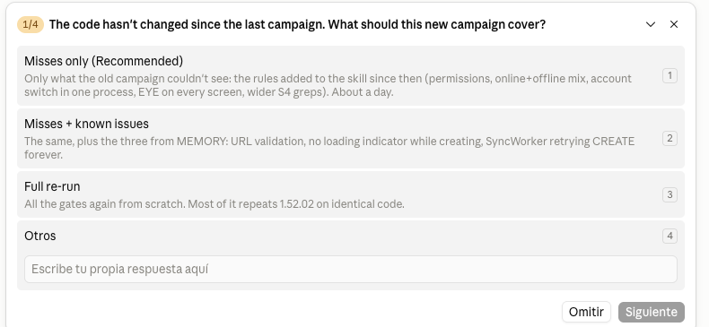

# qa-campaign

[](https://www.skills.sh/DesarrolloAntonio/qa-campaign)

**A pre-release QA campaign your coding agent runs on your app — and the rules that stop it from
telling you everything is fine.**

It drives real builds on real devices, reads your app's own database and your server behind its back,
cuts the network, and fixes what it finds with a regression test it watched fail first.

```bash
npx skills add DesarrolloAntonio/qa-campaign
```

Then, in the project you want to test: **`/qa-campaign`**. There is no prompt to write — it
interviews you first and touches nothing until you have answered.

## Ten bugs it found

Every one of these was in code that passed its project's own test suite. Most were in code a human had
clicked through, and three were in code a *previous* campaign had already approved.

| What it found | Why the tests and the click-through both missed it |
|---|---|
| The **signed release crashed on launch** — every module, every time. The debug build was fine: R8 had renamed a class the SQLite JNI layer looks up by name at runtime. | Nobody installs the *signed* build on a physical phone and opens every screen. The store does that for you, after you ship. |
| **Saving one field silently reverted the others.** The write sent the whole local row, so anything changed elsewhere in the meantime came back undone. | The screen said "saved" and the server agreed. It is only visible if you read the server with a second client. |
| **An edit made offline disappeared** if you edited the same record online before the queue drained. | Offline tests are written offline. This one needs the two states mixed against the same record, in that order. Four of nine P0s were this shape. |
| **Editing a bookmark deleted the tags** someone had added from the web UI. | Same shape, another app — and found on a commit a previous campaign had signed off, with nothing written since. |
| **A bookmark created offline was "adopted" by a different one** when the queue drained: `POST` on an existing URL updates instead of creating. | That is the server's real behaviour, not its documented one. You find it by measuring the server, not by reading its API docs. |
| **A `401` was read as "you don't have permission"**, which left notes read-only forever. | An expired session is not a refusal. To tell them apart you need a server that fails on purpose — not a broken real one. |
| **The app said "saved", the server had answered `4xx`, and the queue retried it forever** — in five different places. | Optimistic UI. The only witness is the server, and nothing in the app was asking it. |
| **The entire bookmark library was written to the system log, in release builds, since 2024.** | No screen shows it. It came out of treating `logcat` as an oracle in its own right, and was verified by counting the strings in the release dex: before 1, after 0. |
| **"Privacy Policy" and "Help" were dead buttons** — which is a Play Store blocker, not a cosmetic bug. | A catalogue derived from your code enumerates what the app *has*. This is an absence, and absences need their own sweep. |
| **Rotating the screen with a dialog open threw away what you had typed** — two apps, several screens. | The test that proved it green first also passed *without* the fix, because it never checked that the screen had actually rotated. That is R9, and the campaign caught itself. |

### The score so far

| Where | Result |
|---|---|
| A multiplatform Nextcloud client (closed source) | **8 P0 + 19 P1 fixed**, each with a test watched failing first, each verified on the device; the lesser ones queued with a recommendation each |
| An Android client for [Shiori](https://github.com/go-shiori/shiori) (public) | **1 P0 + 2 P1**, on code a previous campaign had approved — the whole campaign is published, unedited, in [`examples/shiori/`](examples/shiori/) |
| The release it was extracted from | a dozen gated processes, **69 defects found, 67 fixed** (the other two were product decisions), and a 1,103-test suite green at the end |
| Also run on | a page keeper, a travel log and a fleet terminal — four more products, one config file each |

### Four families explain almost every severe one

If your app syncs, it probably has at least one of these right now:

1. **Uploading state instead of changes.** The queue sends the local row; a `PUT` that replaces the
   whole record then undoes whatever someone changed in the meantime.
2. **Queueing what the server refused.** A `4xx` is not "I am offline", but it was treated as one, so
   the app reported success and retried forever. (With two edges: a `401` is the session, not a
   refusal; and a record created offline has no server id yet, so its `403` means neither.)
3. **Pending changes not travelling with the next write.** Write online before the queue drains and
   the pending edit is dropped — or overwritten by the server's copy.
4. **Treating what was created offline as if it already existed** on the server: adopting a twin by
   URL, sending a temporary id, a `POST` that cannot carry every field.

## Before you run it

A campaign is not a read-only audit. It **installs and drives builds on real devices**, **signs in and
writes to a server**, **changes your source** (fixes, tests, and deliberate breaks it undoes after),
and **deletes the test data it created**. It asks before leaving the ground agreed at setup — that is
R2 — but the ground is what you tell it, and an agent can still get it wrong.

So, every time:

- **on a branch of its own**, with a clean tree before it starts (it will ask; say yes to the branch);
- **a test server and test accounts**, never a personal or production account. No disposable server?
  R10 says what to do instead — and say out loud which data must not be touched;
- **the devices you name and no others**: list them in `qa.config.json` and the scripts refuse the
  rest, so nothing lands on a work or personal phone;
- **a backup of anything you could not lose**, on the server as well as the device.

It is a tool that acts. **You run it at your own risk** — see the licence: no warranty of any kind.

## How to start one

Install the skill once — either way works:

```bash
npx skills add DesarrolloAntonio/qa-campaign                 # installs and links it for you
git clone https://github.com/DesarrolloAntonio/qa-campaign ~/.claude/skills/qa-campaign   # or by hand
```

In the project you want to test:

```bash
cp ~/.claude/skills/qa-campaign/qa.config.example.json qa.config.json
printf 'qa.config.json\nqa.credentials.json\nqa-shots/\n' >> .gitignore
```

Fill in `qa.config.json` — the scripts read `android.*`, `devices`, `managedDevices` and `campaign`;
everything else in there documents the plan for you and for the agent. Then, in Claude Code, **in that
project**, type `/qa-campaign`. That is the whole entry point.

Two things you do not have to prepare: the campaign writes its own `CAMPAIGN.md` (don't pre-copy the
template — a blank one in the docs folder reads as a campaign that was never finished), and it writes
the **credentials template** for you to fill in, if you don't have one yet.

### What it asks before it touches anything

The interview is the first gate. It asks, and waits:



- **which app and which build** — the flavor users actually get, because severity is rated for that one;
- **which devices**, by alias — and only those, so nothing lands on a work or personal phone;
- **which accounts and which server** — a test server, never production. It asks what must not be
  touched, and treats everything already there as real data;
- **how deep offline goes** — none, short or full — decided from the clues in your code, not by habit;
- **fix mode** — fix the severe ones with a test seen red, or report only;
- **where the work goes** — which branch, whether it may commit, which folder the reports live in;
- **what an earlier campaign left**, if there is one, so it doesn't re-find what you already fixed.

Then it opens the setup gate: install and drive the app, read its store, prove the device reaches the
server, run the absence sweeps. That gate closes only when the harness has *demonstrated* it can do
those things.

## How a campaign goes

One **process** per area, each ending in a **gate** that has to close before the next one starts: the
shell, then each module online, then a second context that can invalidate the first (another window
size, offline, a second account), then the release build. Every finding gets a severity, and in fix
mode every P0 and P1 is fixed with a regression test **watched failing first**.

Three things happen along the way that are worth knowing about:

- **It stops for you.** Anything that needs a human — a real login, a physical device, a product
  decision, deleting real data — goes into one queue instead of interrupting every ten minutes. The
  campaign keeps going around it.
- **It says when it could not tell.** "It works", "it is broken" and *nobody could tell* are three
  different results. The third is written down as **unproven** and never closes a gate.
- **It reports its own mistakes.** Every campaign keeps a friction log of where the skill or the
  harness guessed, lied, or was missing something — and that is what the next version is made of.

When it closes you have, in `docs/qa/<date>/`: `CAMPAIGN.md` with the plan, the gates, the log and the
queue; one report per process with its inventory, findings, the screenshots that were looked at and
**what it did not cover**; the screenshots themselves; and `SKILL-FRICTION.md`. In the repository:
one branch, commits per gate, each fix carrying the test that was seen red.

[`examples/shiori/`](examples/shiori/) is exactly that, published unedited.

## Why it does not just believe the screen

The scripts are the cheap half. The valuable half is in [`SKILL.md`](SKILL.md) — fourteen rules, each
of which earned its place on a real campaign. The four that do most of the work:

- **Gates, not a checklist.** A flat list of N scenarios × M devices is never executed; a short list
  of gates with a hard stop at each one is.
- **Inventory before catalogue** — and then the **absence sweeps**, because deriving tests from the
  code enumerates what the app *has* and is structurally blind to what it *lacks*. That is where the
  dead "Privacy Policy" button and the settings screen that never names your server come from.
- **Never one oracle.** The screen, the client's own store, the server, the log, and a reference
  implementation — plus a rule for what to do when they disagree. The interesting defects live in the
  gap between two of them: an optimistic UI reporting success for a write the server refused is
  invisible to anything that only looks at the screen.
- **Seen red, always.** A regression test does not exist until you have watched it fail, for the right
  reason, on the code before the fix.

And **the harness is under test too.** When the tool reports a defect its first suspect is itself — a
false positive costs more than a miss, because it trains you to ignore the tool — and it must never
print a silent all-clear. `tests/run` is its own suite: 51 contract tests against a fake device, with
nothing plugged in.

## Credentials, and why it never types your password

Credentials live in **`qa.credentials.json`**, gitignored, and **you** fill it in. If it isn't there,
the skill writes the template with the keys it needs and stops until you have:

```json
{
  "server": { "url": "https://qa.example.com" },
  "accounts": {
    "A": { "username": "<qa-user>", "password": "<app-password>" },
    "B": { "username": "<qa-user-2>", "password": "<app-password>" }
  }
}
```

The agent never types a password into the app, never asks you for one in the chat, and never puts a
password or a token on a command line, where the process list would show it (R11). What it does
instead: the **adapter** reads that file to talk to your server as the API oracle, and the app's
session is **injected** into the store the login would have written — or signed in against the fake
server below. A real, typed login is a **queue item for you**, once, because only you can do it.

The harness hides secret-looking values everywhere it prints: the store, the log, the request bodies
of the fake server. If you have a field that is a credential in your product but doesn't look like
one, name it in `android.secretKeys`.

## The fake server

Error paths need a server that fails on purpose, and **breaking the real one is not a test** (R10).
[`harness/fake_server.py`](harness/fake_server.py) answers whatever you tell it to, and prints every
request it got — so the report can show what the app actually sent:

```bash
fake_server.py --port 18099 --status 500                        # everything fails
fake_server.py --port 18099 --status 401 --body '{"ok":false}'  # the session died
fake_server.py --port 18099 --status 200 --delay 40             # answers too late
fake_server.py --port 18099 --routes routes.json --status 404   # one route works, the rest don't
```

From an emulator, reach it with `adb reverse tcp:18099 tcp:18099` and `http://127.0.0.1:18099` in the
app — and check it with `net.sh reach`, which asks **as the app** and speaks HTTP over the connection,
because an open port is not a server: a dangling `adb reverse` accepts the connection with nothing
behind it (measured on API 37).

## The harness

`harness/android/ui.py` drives an Android device over `adb`, reading the accessibility tree rather
than pixels — it is text, it can be asserted on, and it is cheap.

```bash
ui.py --device phone tap "text=Add card"   # selectors: text= text~= desc= desc~= id= id~= class= class~=
                                           #            clickable= scrollable= enabled= checked= selected=
ui.py a11y                                 # small targets, overlaps, off-screen, unnamed icons
ui.py db main "select id, title, syncStatus from items"
ui.py rotate 1                             # and reads the rotation back from the window manager
ui.py kill                                 # process death that keeps saved state
ui.py crashes                              # the APP's crashes, not the harness's
```

`harness/net.sh on|off` toggles airplane mode and waits until the change is real in both directions.

Every command refuses, with adb's own message, when no device answers. Everything project-specific
lives in `qa.config.json`; there is nothing to edit in the scripts.

## Any project, not just mobile

The fourteen rules are about method: nothing in them is Android, or mobile, or even a GUI. What is
platform-specific is the **harness**, and that is seven capabilities behind a documented contract
([`harness/README.md`](harness/README.md)) — enumerate the screen as text, act, read the local
store, screenshot, cut the network, force a UI recreation, read crashes.

`harness/android/` implements them. Web, iOS and desktop each need a harness written to that
contract — a real piece of work, and the most useful PR this repo can get.

Pointing the Android harness at a different app is **one config file** — verified by driving a
second, unrelated app on the same emulator with nothing but a different `qa.config.json`.

**If an agent already drives your phone** — tools such as Google's
[ARTEMIS](https://github.com/google/artemis) let an assistant use a real device like a person. That is
the *hands*, and it does "enumerate", "act" and "screenshot" better than `ui.py` does. This skill is
the method on top: what to test (R3, R4), how to know it worked when the screen is not enough (R5),
what a fix must leave behind (R6, R7), and what must not happen along the way (R1, R2, R10, R11). The
two combine — let the agent drive, keep the harness for the store, the network, process death and
crashes. *(Not tried yet: no campaign has run with ARTEMIS as its hands.)*

## Status

Extracted from a production campaign and generalised, then run on four more products, and twice
audited adversarially — the second time 106 findings, all applied or refuted with a reason (see the
merged pull requests). The Android harness is used daily; the process applies to anything you can
drive and query.

The skill is a git checkout, so it moves: note the commit you started with —
`git -C ~/.claude/skills/qa-campaign rev-parse --short HEAD`, which is what `CAMPAIGN.md` records as
*Skill at start* — and don't pull in the middle of a campaign.

**Issues and PRs welcome**, and most useful of all would be `harness/web/` or `harness/ios/`:
<https://github.com/DesarrolloAntonio/qa-campaign/issues> — two templates, *Friction log from a
campaign* and *A harness bug, or an idea*.

**Friction logs are the best issue you can send.** Every campaign keeps `SKILL-FRICTION.md`: each
place where the skill made the agent guess, assumed something untrue, or where a harness command lied
or was missing. At close-out the agent offers to file it here as an issue, with the project's names,
addresses and data taken out, and only after you have read it and said yes. Most of this skill's rules
came from those lines — and two of them came from the Shiori campaign, fixed the same day
([issue #13](https://github.com/DesarrolloAntonio/qa-campaign/issues/13)).

## Licence

MIT — and, in plain words: **no warranty**. It comes as it is; what it does to your code, your
devices, your server and your data is your responsibility.
